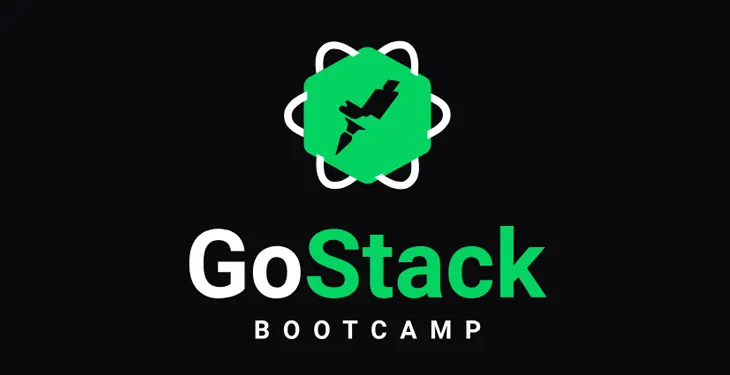

<p align="center">
  
</p>
<h3 align="center"> Desafio 3 - Conceitos do ReactJS </h3>  
<p>  
<p>  

## :rocket: Sobre:  
Neste desafio é proposto continuar a aplicação que iniciamos no [**desafio 2**](https://github.com/muriloportugal/bootcamp11-desafio2-conceitos-node.js) desenvolvendo uma interface simples em **React** para adicionar e remover os repositórios do portifólio.
Colocamos em prática alguns conceitos, e funcionalidades do **React** como:  

- Componentização;
- Estado e Imutabilidade;
- Propriedades;

[Detalhes do desafio](https://github.com/Rocketseat/bootcamp-gostack-desafios/tree/master/desafio-conceitos-reactjs)  

## :checkered_flag: Como testar:  
:warning: **IMPORTANTE:**  
Por se tratar de uma continuação do [**desafio 2**](https://github.com/muriloportugal/bootcamp11-desafio2-conceitos-node.js) é necessário que este esteja rodando em seu computador para que ao executar este desafio o front-end consiga se conectar no back-end criado no [**desafio 2**](https://github.com/muriloportugal/bootcamp11-desafio2-conceitos-node.js).  

Neste projeto foi utilizado o yarn, então caso ainda não tenha, siga este [guia parar instalação](https://classic.yarnpkg.com/en/docs/install) do mesmo.  
Faça o download ou o clone deste repositório para o seu computador.  
```bash
git clone https://github.com/muriloportugal/bootcamp11-desafio3-conceitos-reactJS.git
```
Entre na pasta "bootcamp11-desafio3-conceitos-reactJS" e rode o comando abaixo para que sejam instaladas as dependências:
```bash
yarn 
```
Depois de instalar as dependências, certifique-se que o back-end criado no desafio 2 esteja executando conforme mencionado acima, agora pode executar o comando abaixo e no seu navegador você já vai conseguir abrir este projeto em **http://localhost:3000/**.  
```bash
yarn start
```
---
## :memo: Licença

Esse projeto está sob a licença MIT. Veja o arquivo [LICENSE](LICENSE) para mais detalhes.